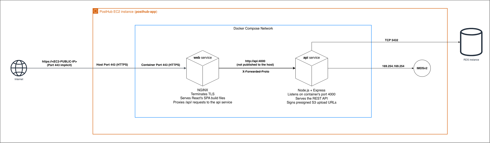
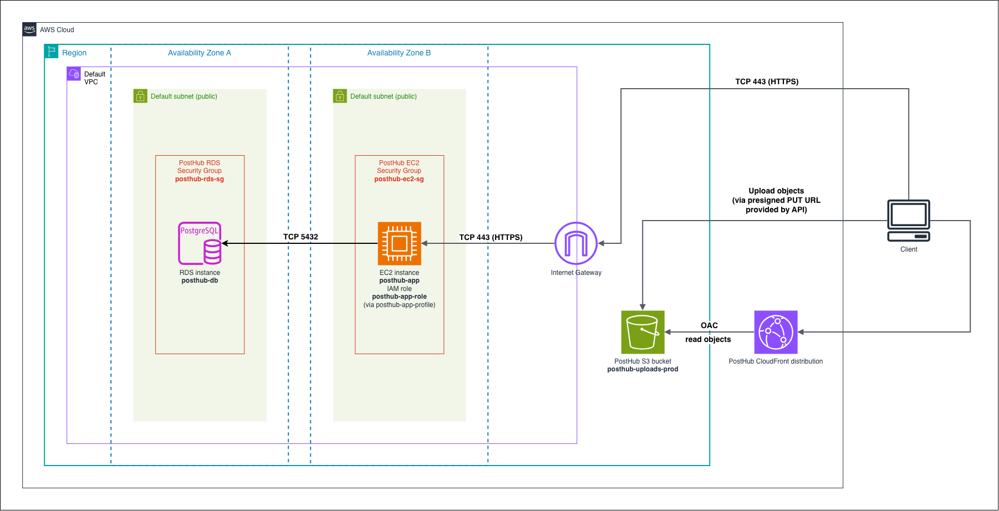

# PostHub

PostHub is a full-stack social publishing platform where users can write posts, follow authors, and like, bookmark, and comment on posts. The platform uses Nginx as a reverse proxy and was built with Node.js, Express, TypeScript, React, and PostgreSQL. It is containerized with Docker and deployed on AWS infrastructure provisioned with Terraform, including an EC2 instance, an RDS database, a CloudFront distribution for serving objects from a private S3 bucket, and an EC2 instance role that generates presigned S3 upload URLs (eliminating the need for static credentials), among other AWS resources.

<figure>
  
  <figcaption><small>Figure 1: PostHub on EC2 — Production Compose Project</small></figcaption>
</figure>

<figure>
  
  <figcaption><small>Figure 2: PostHub AWS Architecture</small></figcaption>
</figure>

For more information on PostHub's Docker and Terraform configurations, check out:
* [PostHub's Docker configuration](./docs/docker.md)
* [PostHub's Terraform configuration](./infra/README.md)

## Architecture

Let's briefly walk through PostHub's architecture, starting from the innermost components and working outward.

As shown in Figure 1, PostHub is a containerized application orchestrated with Docker Compose, with two services running in the production environment: `api` and `web`. The `api` service is an Express server listening on the container's port 4000 and handling HTTP requests to paths prefixed with `/api`. It serves the REST API and communicates with PostHub's PostgreSQL database. The `web` service is an Nginx server that serves PostHub's React single-page application (SPA) build files and reverse-proxies requests to paths prefixed with `/api` to the `api` service. It listens for HTTPS requests on the container's port 443 (published to the host) and terminates TLS. The `api` and `web` containers communicate over the Compose-managed network, so the API does not need to publish port 4000 to the host. PostHub uses session-based authentication, and the `web` service forwards the `X-Forwarded-Proto` header to the `api` service. Express trusts this header because the app sets `trust proxy` to `1` in production, so the backend recognizes the original request as HTTPS and issues a `Secure` session cookie.

Let's zoom out and take a look at PostHub's AWS architecture, shown in Figure 2. The AWS infrastructure is provisioned with Terraform, and the configuration files can be found in `infra/`. PostHub is deployed in the `us-east-1` region and uses the region's default VPC, which provides a default subnet in each Availability Zone. These subnets are public by default.

The Docker Compose project shown in Figure 1 is deployed on an EC2 instance. Its security group allows inbound TCP traffic on port 443 from any address on the internet. We therefore expect HTTPS requests to reach the EC2 instance through port 443 and be handled by the `web` service, as described earlier.

PostHub's PostgreSQL database is deployed on an RDS instance. It is configured as not publicly accessible, so it does not receive a public address. Its security group only allows inbound TCP traffic on port 5432 from resources associated with the EC2 instance's security group. As a result, the PostHub EC2 instance is the only resource permitted to communicate with the RDS instance.

Neither the EC2 instance nor the RDS instance is pinned to a specific subnet or Availability Zone, so AWS determines where to place them. For the RDS instance, AWS selects a subnet from those in the configured DB subnet group. Although both resources belong to the same VPC, they may be placed in different Availability Zones. The EC2 instance can still communicate with the RDS instance through the VPC's local route, which is present in every VPC route table and allows traffic between resources within the VPC. Figure 2 therefore shows them in different Availability Zones to illustrate that this placement is possible and does not prevent them from communicating.

PostHub stores user-uploaded images, such as post pictures and profile avatars, in a private S3 bucket. The bucket's objects cannot be browsed or read directly by users. In Figure 2, the S3 bucket is shown outside the VPC boundary but within the region boundary because S3 is a regional AWS service rather than a resource contained within the VPC.

Clients fetch user-uploaded images through the CloudFront distribution. The distribution is shown outside the region boundary but within the AWS boundary in Figure 2 because CloudFront is a global AWS service. The API returns a normal image URL pointing to the CloudFront domain; the browser then requests that URL from CloudFront, which retrieves the object from S3 behind the scenes. We use an Origin Access Control (OAC) so that CloudFront can send authenticated requests to the S3 origin. The bucket policy grants the CloudFront service permission to retrieve objects from the bucket and includes a condition that restricts this permission to the specific CloudFront distribution we created. This makes CloudFront the only service authorized to read objects from the bucket while preventing direct access.

Conversely, when users upload images, their browsers send the files directly to the S3 bucket using presigned URLs generated by the backend. This keeps the image data out of the API entirely. The bucket also has a CORS configuration that allows `PUT` requests from the app's origin; without it, the browser would block the cross-origin upload.

To avoid using long-term static AWS credentials in the backend, we use an instance profile to attach an IAM role to the EC2 instance running the API. The role's trust policy allows the Amazon EC2 service to assume the role, so AWS Security Token Service (STS) can issue temporary credentials. EC2 makes these credentials available through the Instance Metadata Service (IMDS), where the AWS SDK running in the backend can retrieve them and use them to generate the presigned URLs. The role's inline policy grants only `s3:PutObject` permission, so the credentials cannot be used to read or list objects in the bucket.

## Getting started (development)

Docker is the only prerequisite: there is no host Node or npm. No `.env` file is
needed either: `docker-compose.yml` falls back to throwaway local credentials.

```bash
docker compose up --build                  # web :5173, api :4000, db :5432
docker compose exec api npm run migrate    # apply the schema
docker compose exec api npm run seed       # category reference data
docker compose exec api npm run seed:dev   # optional: sample users and posts
```

Add `-d` to the first command (`docker compose up --build -d`) to start the stack
detached, which frees the terminal for the `exec` commands; follow the output
afterwards with `docker compose logs -f api`.

Then open http://localhost:5173. `docker compose down` stops the stack; add `-v`
to drop the database volume as well, which is how you start from a clean schema,
since migrations are forward-only.

Image uploads stay dormant locally: with the S3 environment variables unset,
`POST /api/uploads/presign` answers `503` and posts render without images.

## Getting started (production)

### 1. Provision the AWS infrastructure

From `infra/`, Terraform provisions everything described in the Architecture
section: the EC2 instance, the RDS database, the private S3 bucket and its
CloudFront distribution, the security groups, and the instance role.

```bash
terraform init     # once, and after changing provider versions
terraform apply    # roughly 10-15 minutes, mostly CloudFront and RDS
```

`apply` prompts for the RDS master password, which has no default so that nothing
weak is ever committed. It also needs AWS credentials (see
[PostHub's Terraform configuration](./infra/README.md) for the prerequisites).

Once it finishes, `terraform output` prints the values the deploy needs: the app
server's public IP and a ready-made SSH command, the database endpoint, the
uploads bucket name, and the CloudFront domain.

### 2. Configure the environment

SSH onto the app server (`terraform output -raw app_ssh`), clone the repository,
and copy `.env.example` to a root `.env`. Compose auto-loads it, and it is
git-ignored. `docker-compose.prod.yml` has no fallbacks.

```
DATABASE_URL=postgresql://<user>:<password>@<db_endpoint>/<db_name>
SESSION_SECRET=<openssl rand -hex 32>
S3_BUCKET=<uploads_bucket>
AWS_REGION=us-east-1
S3_PUBLIC_BASE_URL=https://<cloudfront_domain>
```

Every placeholder except the session secret comes from `terraform output`; note
that `db_endpoint` already includes the port.

Notice what is absent: `AWS_ACCESS_KEY_ID` and `AWS_SECRET_ACCESS_KEY` are never
set here. The instance role supplies the backend's credentials through instance
metadata, so no long-lived AWS keys exist on the box.

### 3. Generate the TLS certificate

Nginx terminates TLS with a self-signed certificate generated on the instance.
It is self-signed because the app is reached at the EC2 instance's raw public IP:
there is no domain name to prove ownership of, and no Elastic IP, so the address
changes every time the instance stops and starts. What this deployment needs from
TLS is termination, not trust. Terminating TLS is what lets nginx forward
`X-Forwarded-Proto: https`, the first link in the chain that produces a `Secure`
session cookie. A publicly trusted certificate would add trust, and trust has no
bearing on that mechanism.

```bash
mkdir -p certs
openssl req -x509 -newkey rsa:2048 -nodes \
  -keyout certs/key.pem -out certs/cert.pem -days 365 \
  -subj "/CN=posthub" -addext "subjectAltName=IP:<app_public_ip>"
chmod 600 certs/key.pem
```

`certs/` is git-ignored, since the key is a secret. Generate the files before
starting the stack, because nginx refuses to start when `ssl_certificate` points
at a missing path. The public IP is baked into the certificate's subject
alternative name, so after every stop and start, regenerate it with the new IP
and reload the edge with `docker compose -f docker-compose.prod.yml restart web`.

### 4. Build and start the stack

```bash
docker compose -f docker-compose.prod.yml up -d --build
```

The `-f` is required every time, because `docker-compose.prod.yml` is not
Compose's default file and is therefore only used when named. It is also
self-contained, so there is no second `-f` and no service list to pass.

PostHub keeps two independent Compose files rather than a base file plus an
override. `docker-compose.yml`, used in the previous section, is the development
stack: a local Postgres container, bind mounts for hot reload, host ports for all
three services, and throwaway credentials, so `docker compose up` works with no
configuration at all. `docker-compose.prod.yml` is the deployed stack: images
built at the `production` target, `NODE_ENV=production`, no bind mounts, no `db`
service because the database is RDS, the certificate and `nginx.prod.conf` mounted
into the nginx edge, only port 443 published, and required secrets with no
fallbacks.

The two files differ on nearly every key, so layering one over the other would
mean overriding almost everything the base declared. Keeping each file as the
complete truth for its own environment is easier to read, and it removes any
reason to combine them.

### 5. Migrate and seed

RDS starts empty, so the schema has to be applied once before the app is usable.

```bash
docker compose exec api node dist/db/migrate.js
docker compose exec api node dist/db/seed.js
```

These are the compiled entry points, not `npm run migrate`. The production image
installs no development dependencies, so it has no `tsx` to execute TypeScript
directly; it ships `dist/` alongside the raw `migrations/*.sql` files the runner
applies. Both commands run inside the `api` container started in the previous
step, so the stack has to be up first.

Migrating is a deploy step and never a boot step: the server does not run
migrations on startup, so a restart never touches the schema. Seeding inserts the
category reference data that creating a post depends on, and it is idempotent, so
running it again is safe. There is no production equivalent of `seed:dev`, which
refuses to run under `NODE_ENV=production`.

### 6. Verify the deployment

```bash
curl -sk https://<app_public_ip>/api/health
```

A healthy stack answers `{"status":"ok","database":"ok"}`. The `-k` flag skips
certificate verification, which is necessary because the certificate is
self-signed. A `503` with `"database":"error"` means the API is up but cannot
reach RDS.

Then open `https://<app_public_ip>` in a browser and accept the certificate
warning, which is expected and is the only visible consequence of self-signing.
Register an account, then reload the page. If the session survives the reload,
the entire chain described in the Architecture section is working: nginx
terminated TLS and forwarded `X-Forwarded-Proto`, Express trusted it and issued
the `Secure` `posthub.sid` cookie, and the session store persisted it in RDS.

If the S3 variables are set, attach an image to a post as a final check. That one
action exercises the presigned upload, the bucket CORS rule, the instance role
supplying the signing credentials, and the CloudFront read path, since the image
only renders if the stored key resolves through the distribution.
