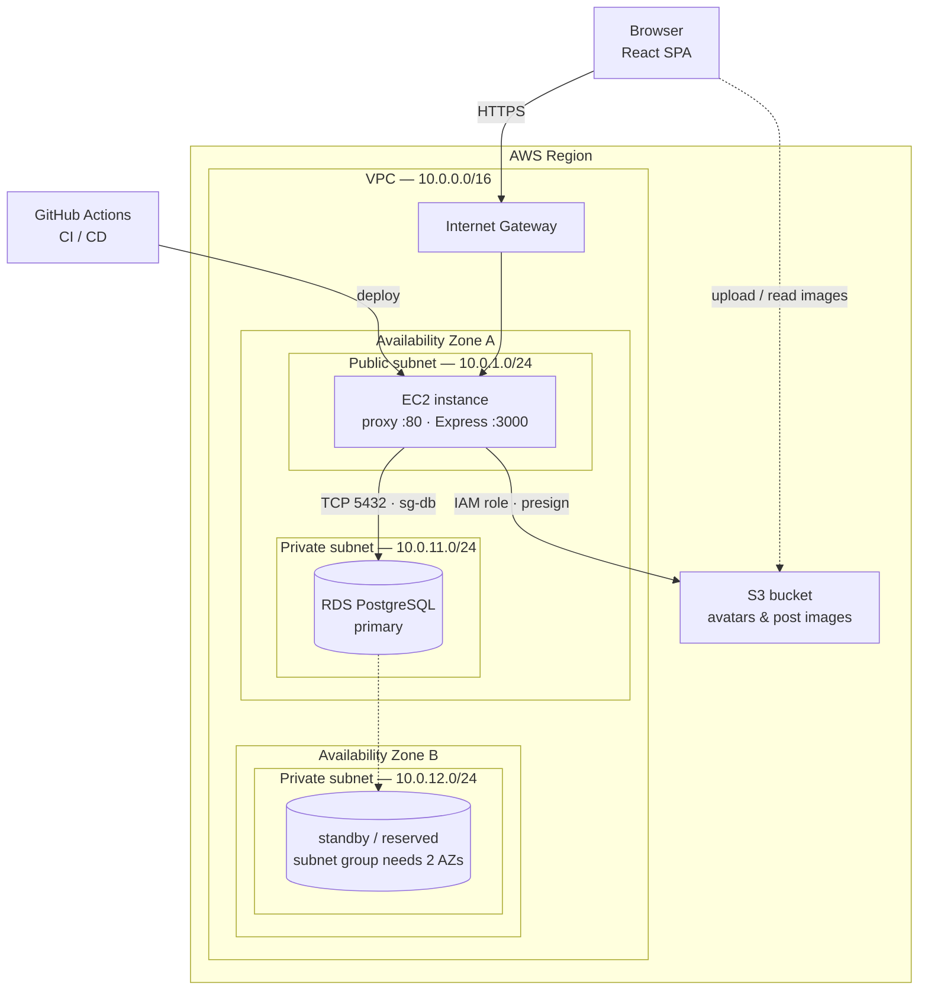

# Architecture — PostHub

How the application is structured and how it runs on AWS.

**Pattern:** reverse proxy. A frontend server owns the single public origin: it
serves the compiled React build and forwards `/api/*` to the backend. The browser
never learns the backend's address, so every request is same-origin and CORS never
enters the picture.

**AWS scope:** core services only — EC2 (compute), RDS (database), S3 (storage).

---

## Diagram

---

## Request lifecycle

A page load and a data call take different paths through the same door.

1. The browser resolves the application's address and reaches the **Internet
   Gateway**, the VPC's only route to the public internet.
2. The gateway routes to the **EC2 instance** in the public subnet.
3. The **frontend server** inspects the request path:
   - Not `/api/*` → it reads a file from the compiled `dist/` directory and returns
     it. This is how `index.html`, the JS bundle, and the CSS arrive.
   - Starts with `/api/*` → it opens a second request to the backend on `localhost:3000`,
     pipes the body across, and relays the response back untouched.
4. The **Express backend** authenticates the session, runs its query against **RDS**
   over the private subnet, and returns JSON.
5. The response travels back out the same path.

The important property: steps 3 and 4 happen entirely inside the instance. The
backend has no public listener, so the only way to reach it is through the proxy.

---

## Components

### Compute — EC2

A single instance in a public subnet, running two Node processes:

| Process | Port | Role |
| --- | --- | --- |
| Frontend server | `80` | Serves the React build from `dist/`; proxies `/api/*` |
| Express backend | `3000` | REST API, session handling, database access |

Both are managed by a process supervisor so they restart on failure and on reboot.

**Why one instance rather than two:** the proxy reaches the backend over `localhost`,
which means no network hop, no security group between them, and no service discovery.
Splitting them across instances is the natural next step if the API ever needs to
scale independently — the code does not change, only the proxy's target host.

**Why the backend has no public port:** the security group opens `80`/`443` only.
Port `3000` is unreachable from outside the instance, so the proxy is not merely a
convention — it is the sole path in.

### Database — RDS for PostgreSQL

A managed PostgreSQL instance in a **private subnet**, with no public accessibility.
It holds the domain tables (see `DatabaseDesign.md`) and the session table that
`connect-pg-simple` manages.

**Why sessions live here:** session state is server-side by design. Keeping it in
RDS rather than in the instance's memory means a restart or deploy does not log
everyone out, and a second instance could later share the same session store without
any change to the auth code.

**Why the private subnet:** the database has no route to the internet and no public
endpoint. The only thing that can reach it is a resource inside the VPC that its
security group explicitly allows — that is, the EC2 instance. This is the single
most valuable network boundary in the design.

**The two-AZ requirement:** an RDS **DB subnet group** must span at least two
Availability Zones, even for a single-AZ deployment. The second private subnet
therefore exists whether or not a standby runs in it. Enabling Multi-AZ later becomes
a configuration change rather than a network redesign.

### Storage — S3

A bucket holding avatars and post images. The database stores **object keys**, never
URLs — the key is stable, while the URL depends on the bucket, region, and access
strategy, all of which can change.

The EC2 instance carries an **IAM instance role** granting scoped access to this
bucket. No access keys are stored on disk.

**S3 is not inside the VPC.** It is a regional service reached over the AWS network.
Traffic from the instance leaves via the Internet Gateway by default; a **VPC gateway
endpoint** can keep it on the AWS backbone instead, at no cost.

### Delivery — GitHub Actions

**CI** runs on every push: lint, type-check, tests, and build. Tests are a hard gate —
a failure stops the pipeline before anything ships.

**CD** connects to the instance, pulls the new revision, installs dependencies, runs
`vite build` to regenerate `dist/`, and restarts both processes. `dist/` is
gitignored, which is precisely why it is built on the instance rather than committed.

---

## Network

### VPC — `10.0.0.0/16`

A single VPC spanning two Availability Zones within one Region.

| Subnet | CIDR | AZ | Contents | Internet route |
| --- | --- | --- | --- | --- |
| Public | `10.0.1.0/24` | A | EC2 instance | via Internet Gateway |
| Private | `10.0.11.0/24` | A | RDS primary | none |
| Private | `10.0.12.0/24` | B | RDS standby / reserved | none |

**What makes a subnet "public":** not a setting, but its route table. A public subnet
has a route to the Internet Gateway; a private one does not. That single routing
difference is the whole distinction.

**No NAT Gateway.** A NAT would let private resources make outbound connections, but
RDS is a managed service that needs no outbound internet access. Omitting it removes
both a cost and a component.

### Security groups

Security groups are stateful firewalls attached to resources rather than subnets.

| Group | Attached to | Inbound rule |
| --- | --- | --- |
| `sg-web` | EC2 instance | `80` / `443` from `0.0.0.0/0` |
| `sg-db` | RDS instance | `5432` **from `sg-web` only** |

`sg-db` referencing `sg-web` — rather than an IP range — is the key detail. The rule
means "whatever is currently running the web tier", so it stays correct if the
instance is replaced or its address changes.

SSH access is deliberately excluded from the table above: exposing `22` to the
internet is worth avoiding, and Session Manager provides shell access without an
inbound rule at all.

---

## Environments

Local development mirrors this topology in miniature via Docker Compose:

| Concern | Local | Deployed |
| --- | --- | --- |
| Frontend | Vite dev server, proxying `/api` | Node server serving `dist/` |
| Backend | Express in a container | Express under a process supervisor |
| Database | PostgreSQL container | RDS in a private subnet |
| Images | Local directory or bucket stub | S3 |
| Config | `.env`, gitignored | Environment variables on the instance |

The application code is identical across both. Everything that differs — hosts,
ports, credentials, bucket names — arrives through environment variables, which is
why the deployed environment needs no code change to work.

---

## Deliberate omissions

Each of these is a reasonable production choice, excluded here to keep the surface
small:

| Omitted | What it would add | Why not now |
| --- | --- | --- |
| Load balancer | TLS termination, health checks, multiple instances | One instance has nothing to balance |
| CloudFront | Edge caching of static assets | The proxy serves them adequately at this scale |
| NAT Gateway | Outbound internet for private subnets | Nothing in them needs it |
| Container orchestration | Rolling deploys, self-healing | A supervisor covers restarts |
| Secrets manager | Rotated, audited credentials | Instance environment variables suffice |
| Multi-AZ RDS | Automatic failover | The subnet group already permits enabling it |

The pattern worth noticing: none of these omissions constrains the architecture.
Each can be introduced later without restructuring what exists.

---

## Open questions

### TLS termination

Session cookies should carry the `Secure` flag, which requires HTTPS. Without a load
balancer or CloudFront, certificates have to terminate on the instance itself — a
reverse proxy such as Caddy or nginx with Let's Encrypt in front of the Node
processes. The alternative is accepting plain HTTP, which weakens session security.
This is the one place where "core services only" has a real cost.

### Image upload path

Two options, with a genuine trade-off:

- **Presigned URLs.** The backend signs a URL and the browser uploads straight to S3.
  Efficient — bytes never touch the instance. But the upload is a cross-origin
  request to `s3.amazonaws.com`, so the bucket needs a CORS configuration. This is
  the single point where the architecture's same-origin property does not hold.
- **Upload through the backend.** The browser posts to `/api/...` and the instance
  forwards to S3. Same-origin throughout, no bucket CORS. But every byte transits
  the instance, consuming its bandwidth and memory.

The first is what production systems do. The second is simpler and preserves the
property the whole reverse-proxy design exists to protect.
