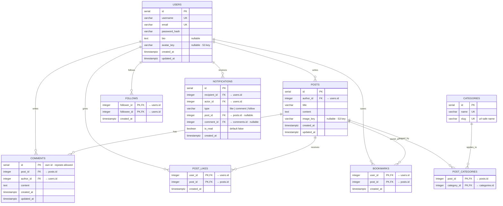

# PostHub - Entity relationship diagram

```mermaid
erDiagram
  USERS ||--o{ POSTS : writes
  USERS ||--o{ COMMENTS : writes
  POSTS ||--o{ COMMENTS : has
  USERS ||--o{ POST_LIKES : gives
  POSTS ||--o{ POST_LIKES : receives
  USERS ||--o{ BOOKMARKS : saves
  POSTS ||--o{ BOOKMARKS : saved_as
  POSTS ||--o{ POST_CATEGORIES : tagged_by
  CATEGORIES ||--o{ POST_CATEGORIES : applies_to
  USERS ||--o{ FOLLOWS : follows
  USERS ||--o{ NOTIFICATIONS : receives

  USERS {
    serial id PK
    varchar username UK
    varchar email UK
    varchar password_hash
    text bio "nullable"
    varchar avatar_key "nullable · S3 key"
    timestamptz created_at
    timestamptz updated_at
  }
  POSTS {
    serial id PK
    integer author_id FK "→ users.id"
    varchar title
    text content
    varchar image_key "nullable · S3 key"
    timestamptz created_at
    timestamptz updated_at
  }
  CATEGORIES {
    serial id PK
    varchar name UK
    varchar slug UK "url-safe name"
  }
  POST_CATEGORIES {
    integer post_id PK,FK "→ posts.id"
    integer category_id PK,FK "→ categories.id"
  }
  COMMENTS {
    serial id PK "own id · repeats allowed"
    integer post_id FK "→ posts.id"
    integer author_id FK "→ users.id"
    text content
    timestamptz created_at
    timestamptz updated_at
  }
  POST_LIKES {
    integer user_id PK,FK "→ users.id"
    integer post_id PK,FK "→ posts.id"
    timestamptz created_at
  }
  BOOKMARKS {
    integer user_id PK,FK "→ users.id"
    integer post_id PK,FK "→ posts.id"
    timestamptz created_at
  }
  FOLLOWS {
    integer follower_id PK,FK "→ users.id"
    integer followee_id PK,FK "→ users.id"
    timestamptz created_at
  }
  NOTIFICATIONS {
    serial id PK
    integer recipient_id FK "→ users.id"
    integer actor_id FK "→ users.id"
    varchar type "like | comment | follow"
    integer post_id FK "→ posts.id · nullable"
    integer comment_id FK "→ comments.id · nullable"
    boolean is_read "default false"
    timestamptz created_at
  }
```