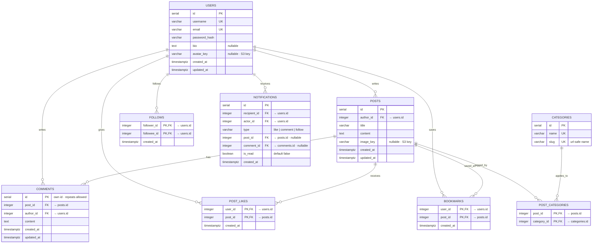

# Database design — PostHub

Schema for PostHub. Derived from the screen inventory:
every design decision here traces back to a query some screen needs to run.

**Engine:** PostgreSQL

The full model is designed up front — including tables for features built later —
so that no destructive migrations are needed as the application grows.

---

## Entity relationship diagram



---

## Reading the notation

### Cardinality

| Symbol | Meaning |
| --- | --- |
| `\|\|` | exactly one |
| `o{` | zero or more |

So `USERS \|\|--o{ POSTS` reads: **one** user writes **zero-to-many** posts.

The `o` is load-bearing — a newly registered user has no posts, and zero is valid.
Every relationship in this diagram is one-to-many at the database level. True
many-to-many exists only *through* a join table.

### Keys

| Marker | Meaning |
| --- | --- |
| `PK` | primary key |
| `FK` | foreign key |
| `UK` | unique constraint |
| `PK,FK` | both — a foreign key that is also part of the primary key |

An ERD lists columns, so a **composite** primary key cannot be its own row. Two
columns marked `PK` means the primary key is *that pair*. Neither column is unique
on its own; only the combination is.

Composite primary keys in this schema:

- `post_categories` → `PRIMARY KEY (post_id, category_id)`
- `post_likes` → `PRIMARY KEY (user_id, post_id)`
- `bookmarks` → `PRIMARY KEY (user_id, post_id)`
- `follows` → `PRIMARY KEY (follower_id, followee_id)`

In DDL the distinction is unambiguous:

```sql
CREATE TABLE post_likes (
  user_id    integer NOT NULL REFERENCES users(id) ON DELETE CASCADE,
  post_id    integer NOT NULL REFERENCES posts(id) ON DELETE CASCADE,
  created_at timestamptz NOT NULL DEFAULT now(),
  PRIMARY KEY (user_id, post_id)
);
```

`REFERENCES` makes each column a FK. The separate `PRIMARY KEY (...)` line makes
the *pair* the PK. That is exactly what `PK,FK` on both rows encodes.

---

## Tables

### USERS

The identity table. Everything else points back to it.

| Column | Type | Notes |
| --- | --- | --- |
| `id` | `serial` | PK. Auto-incrementing surrogate key; Postgres creates a sequence. |
| `username` | `varchar` | Unique. Used in URLs and displayed on cards. |
| `email` | `varchar` | Unique. The login credential. |
| `password_hash` | `varchar` | bcrypt output — never the password itself. |
| `bio` | `text` | Free-form, unbounded. Shown on Profile. Nullable. |
| `avatar_key` | `varchar` | S3 object key, not a URL. Nullable. |
| `created_at` | `timestamptz` | Surfaces as "joined date" on Profile. |
| `updated_at` | `timestamptz` | Tracks profile edits. |

**No `role` column.** Authorization is ownership-based: a user may edit or delete a
resource if they created it. Roles are a scalar column on an existing table, so
introducing them later is a purely additive migration
(`ALTER TABLE users ADD COLUMN role varchar NOT NULL DEFAULT 'user'`) that extends
the ownership guard rather than replacing it. Nothing in this model needs to
anticipate it.

---

### POSTS

The core content table.

| Column | Type | Notes |
| --- | --- | --- |
| `id` | `serial` | PK. |
| `author_id` | `integer` | FK → `users.id`. Who wrote it. |
| `title` | `varchar` | Bounded length; shown on cards. |
| `content` | `text` | Unbounded body. |
| `image_key` | `varchar` | S3 key. Nullable. |
| `created_at` | `timestamptz` | Default sort key on Explore. |
| `updated_at` | `timestamptz` | Powers "edited" indicators. |

**Relationship — `USERS ||--o{ POSTS`**

- One user writes zero-to-many posts.
- One post has exactly one author — enforced by `author_id NOT NULL`.
- The FK lives on the *many* side. It always does.
- `ON DELETE CASCADE`: deleting a user removes their posts.

**No `status` column.** Drafts are out of scope, which keeps every posts query
free of a status filter.

---

### CATEGORIES

A small lookup table of seeded reference data.

| Column | Type | Notes |
| --- | --- | --- |
| `id` | `serial` | PK. |
| `name` | `varchar` | Unique. Display label, e.g. "Philosophy". |
| `slug` | `varchar` | Unique. URL-safe, e.g. `philosophy`. |

**Why both `name` and `slug`:** `name` is for humans, `slug` is for
`/explore?category=philosophy`. Deriving one from the other at runtime gets
fragile with accents and spaces.

No `created_at` — this is reference data, not user content.

---

### POST_CATEGORIES

The join table making categories many-to-many.

| Column | Type | Notes |
| --- | --- | --- |
| `post_id` | `integer` | PK, FK → `posts.id`. |
| `category_id` | `integer` | PK, FK → `categories.id`. |

`PRIMARY KEY (post_id, category_id)`

**Relationships — `POSTS ||--o{ POST_CATEGORIES` and `CATEGORIES ||--o{ POST_CATEGORIES`**

- Two one-to-many relationships that *compose* into many-to-many.
- One post has zero-to-many category rows; one category has zero-to-many post rows.
- Net effect: a post holds several categories, a category spans many posts.

**Why the composite PK matters:**

- It blocks duplicates — a post cannot be tagged "Philosophy" twice.
- No surrogate `id` needed; the pair *is* the identity.
- It also provides a free index on `post_id`.

---

### COMMENTS

A second true relation between `users` and `posts`, carrying its own content.

| Column | Type | Notes |
| --- | --- | --- |
| `id` | `serial` | PK. Needed here, unlike join tables — see below. |
| `post_id` | `integer` | FK → `posts.id`. |
| `author_id` | `integer` | FK → `users.id`. |
| `content` | `text` | |
| `created_at` | `timestamptz` | |
| `updated_at` | `timestamptz` | |

**Relationships — `POSTS ||--o{ COMMENTS` and `USERS ||--o{ COMMENTS`**

- One post has zero-to-many comments.
- One user writes zero-to-many comments.
- Each comment has exactly one post and exactly one author.

**The key contrast worth internalizing:** `comments` looks structurally like a join
table (two FKs) but **isn't** one. It carries its own content and allows repeats —
the same user can comment twice on one post — so `(post_id, author_id)` is not
unique and a surrogate key is required.

No `parent_comment_id` — threading is out of scope. Adding it later is a
self-referential FK.

---

### POST_LIKES

| Column | Type | Notes |
| --- | --- | --- |
| `user_id` | `integer` | PK, FK → `users.id`. |
| `post_id` | `integer` | PK, FK → `posts.id`. |
| `created_at` | `timestamptz` | Enables "recently liked" sorting later. |

`PRIMARY KEY (user_id, post_id)`

**Relationships — `USERS ||--o{ POST_LIKES`, `POSTS ||--o{ POST_LIKES`**

- One user gives zero-to-many likes; one post receives zero-to-many.

**Why the composite PK is doing real work:**

- It enforces one like per user per post — at the database level, not in app code.
- "Unlike" is just a `DELETE`. The row's existence *is* the like.
- Like count = `COUNT(*) WHERE post_id = X`.
- "Did I like this?" = does row `(me, X)` exist? A PK lookup — fast.

That second query is precisely why this cannot just be a counter column on `posts`.

---

### BOOKMARKS

Structurally identical to `post_likes`.

| Column | Type | Notes |
| --- | --- | --- |
| `user_id` | `integer` | PK, FK → `users.id`. |
| `post_id` | `integer` | PK, FK → `posts.id`. |
| `created_at` | `timestamptz` | |

`PRIMARY KEY (user_id, post_id)`

Same composite PK logic, same toggle semantics. The difference is purely semantic:
likes are a public signal, bookmarks are private. The Bookmarks screen filters by
`user_id = me`.

---

### FOLLOWS

The self-referential table.

| Column | Type | Notes |
| --- | --- | --- |
| `follower_id` | `integer` | PK, FK → `users.id`. The person doing the following. |
| `followee_id` | `integer` | PK, FK → `users.id`. The person being followed. |
| `created_at` | `timestamptz` | |

`PRIMARY KEY (follower_id, followee_id)`

**Relationship — `USERS ||--o{ FOLLOWS` (twice)**

- Both FKs target the *same* table. That is what makes it self-referential.
- One user appears in many rows as follower, and many rows as followee.
- Following is directional and asymmetric: A→B does not imply B→A. A mutual
  follow is two rows.
- Follower count = `COUNT(*) WHERE followee_id = X`.
- Following count = `COUNT(*) WHERE follower_id = X`.

This table powers the personalized feed:

```sql
SELECT * FROM posts
WHERE author_id IN (
  SELECT followee_id FROM follows WHERE follower_id = $1
);
```

**Naming caution:** `follower_id` and `followee_id` are one letter apart and easy to
swap. A mix-up here inverts the entire feed silently — treat the `-er` / `-ee` pair
as a fixed convention across schema, services, and API responses.

---

### NOTIFICATIONS

The loosest table, by necessity.

| Column | Type | Notes |
| --- | --- | --- |
| `id` | `serial` | PK. |
| `recipient_id` | `integer` | FK → `users.id`. Who sees it. |
| `actor_id` | `integer` | FK → `users.id`. Who caused it. |
| `type` | `varchar` | `'like' \| 'comment' \| 'follow'`. |
| `post_id` | `integer` | FK → `posts.id`. Nullable. |
| `comment_id` | `integer` | FK → `comments.id`. Nullable. |
| `is_read` | `boolean` | Default `false`. Drives the unread badge. |
| `created_at` | `timestamptz` | |

**Relationship — `USERS ||--o{ NOTIFICATIONS` (twice)**

- Also self-referential through `users`, like `follows`.
- One user receives many; one user triggers many.

**Why the FKs are nullable:**

- A follow notification has no post and no comment.
- A like has a `post_id` but no `comment_id`.
- The target columns are conditionally relevant, so the table cannot be fully
  constrained.

This is a known trade-off (a polymorphic-style association). The alternative — one
table per notification type — is stricter but multiplies queries for a single
unified list. At this scale, nullable columns plus a `CHECK` per `type` is the
pragmatic call.

---

## Cardinality at a glance

| Relationship | Cardinality | FK location |
| --- | --- | --- |
| users → posts | 1 : 0..N | `posts.author_id` |
| users → comments | 1 : 0..N | `comments.author_id` |
| posts → comments | 1 : 0..N | `comments.post_id` |
| posts ↔ categories | M : N *(via join)* | `post_categories` |
| users ↔ posts (likes) | M : N *(via join)* | `post_likes` |
| users ↔ posts (bookmarks) | M : N *(via join)* | `bookmarks` |
| users ↔ users (follows) | M : N *(self-referential)* | `follows` |
| users → notifications | 1 : 0..N *(×2 roles)* | `recipient_id`, `actor_id` |

---

## Constraints and indexes

### Constraints

```sql
CHECK (follower_id <> followee_id)          -- blocks self-follow
CHECK (type IN ('like', 'comment', 'follow'))
```

`ON DELETE CASCADE` on all join tables — deleting a post should remove its likes,
bookmarks, category links, and comments.

### Indexes

| Index | Why |
| --- | --- |
| `posts(author_id)` | The feed query filters on it constantly. |
| `posts(created_at DESC)` | Default sort on Explore. |
| `comments(post_id)` | Post Detail loads comments by post. |
| `follows(follower_id)` | The feed's `IN` subquery. |
| `post_likes(post_id)` | Like counts per post — see note. |

Composite PKs already index their **leading** column, so `post_likes(user_id, ...)`
is covered by the PK. But `post_likes(post_id)` alone is *not* — hence the separate
index once like counts get queried per post.

---

## Design decisions

### Counts are derived, not stored

Like counts, comment counts, and follower counts are computed with `COUNT`
aggregates rather than denormalized columns on `posts` / `users`.

It is tempting to add `like_count` and `comment_count` to `posts` to avoid joins.
Resist for now. Counters require careful synchronization (triggers or app-side
updates) and drift when anything goes wrong. Compute with `COUNT` first; denormalize
only if a real problem gets measured. **Correctness before performance.**

### Viewer-relative state drives the join tables

Every card needs more than aggregate counts. It needs to know *"did **I** like
this?"* and *"did **I** bookmark this?"* — a per-user existence check, not a number.
That requirement is what makes `post_likes` and `bookmarks` join tables rather than
integer columns.

### Session storage is outside this model

Session-based auth uses `connect-pg-simple`, which creates and manages its own
table (`sid`, `sess`, `expire`). It is library-managed infrastructure, not part of
the domain model, so it does not appear in the ERD.

### Self-follow is disallowed

A `CHECK (follower_id <> followee_id)` constraint on `follows` prevents a user from
following themselves. Enforcing it at the database level means no application code
path — controller, service, or seed script — can create such a row.

### Follow naming: `follower_id` / `followee_id`

The `-er` / `-ee` pair is the convention for this schema: `follower_id` is the user
doing the following, `followee_id` is the user being followed. The alternative
(`following_id`) is rejected because it reads ambiguously — it could plausibly mean
either side of the relationship.

The two column names are one letter apart, so consistency is enforced by convention
rather than by the type system. A mix-up inverts the feed silently.
